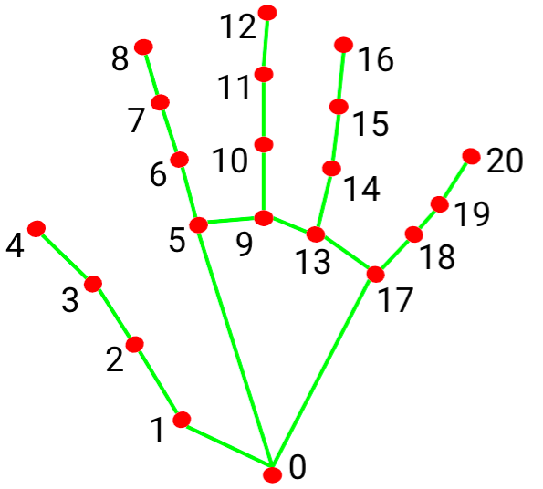
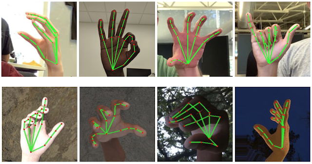
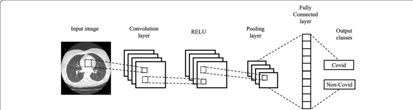
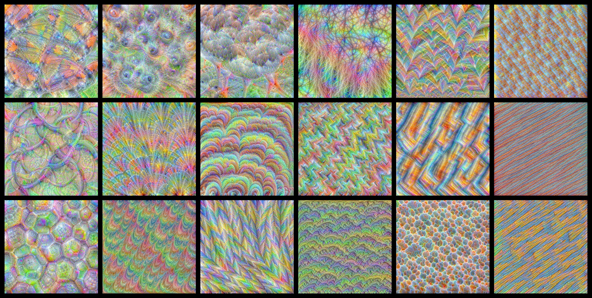
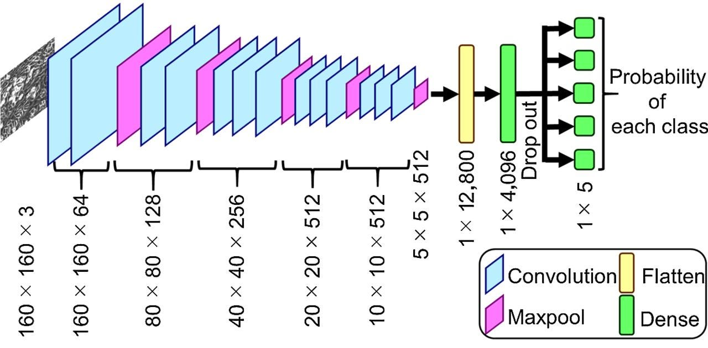
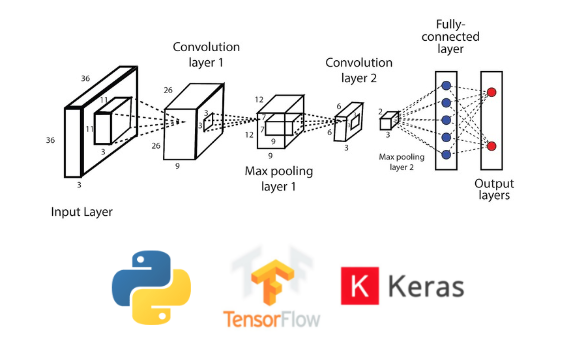

# 📌 Real Time hand gesture recognition system 

## 📖 Project Overview

This project focuses on developing a Real-Time Hand Gesture Recognition System using deep learning techniques. The system enables intuitive human-computer interaction and is particularly useful in:

 Assistive technologies

 Virtual interfaces

 Sign language interpretation

 Touchless system control

The project leverages Convolutional Neural Networks (CNNs) along with computer vision frameworks to detect and classify hand gestures in real time.

## 🎯 Objective

To build a real-time system capable of identifying and classifying hand gestures with high accuracy using deep learning and computer vision techniques.

## 🛠️ Tools and technologies:

    Python
    OpenCV
    TensorFlow
    MediaPipe
    Convolutional Neural Networks (CNNs)
## 🧠 System architecture:

1️⃣ Hand Detection – MediaPipe
    
   MediaPipe is used for detecting and tracking hand landmarks in real time. It extracts keypoints from the hand to help in gesture classification.

   

  
  
  
  

2️⃣ Image Processing – OpenCV

 OpenCV handles:

    Real-time video capture
    Frame preprocessing
    Landmark visualization
    Integration with the trained model

   

3️⃣ Gesture Classification – CNN Model

   A Convolutional Neural Network (CNN) is trained on a gesture dataset to classify hand gestures accurately.
   

  
  
  
  
  

## 🔮 Features:
   
   Real-time hand detection

   Gesture classification using CNN

   Live webcam integration

   High accuracy recognition

   Scalable for multiple gesture classes

 ## Methodology:

  Gesture dataset collection

  Data preprocessing and labeling

  Model training using TensorFlow

  Model validation and accuracy testing

  Integration with real-time camera input using OpenCV

   Deployment testing

  ## 🌍 Applications:

   Sign language recognition

   Virtual control systems

   Touchless interfaces

   Assistive technologies

    
  
